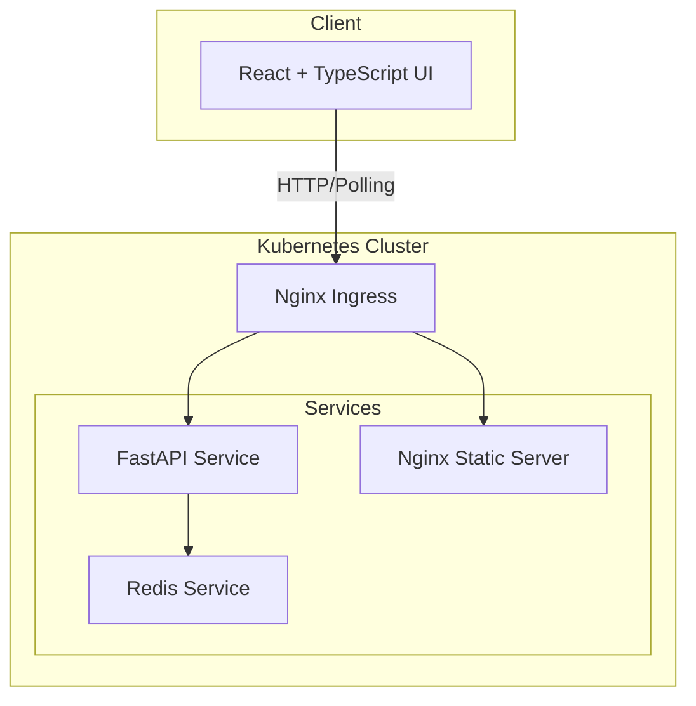

# Planning Poker - Architecture Documentation

## System Overview
Real-time Planning Poker application for agile estimation running on Kubernetes.

## Architecture Diagram


## Data Model

### Room Document
**Redis Key:** `room:<room_uuid>`

**Structure:**
```json
{
  "id": "550e8400-e29b-41d4-a716-446655440000",
  "name": "Sprint 42 Planning",
  "state": "voting",
  "created_at": "2026-01-07T10:30:00Z",
  "users": {
    "user-uuid-123": {
      "name": "Alice",
      "vote": null
    },
    "user-uuid-456": {
      "name": "Bob",
      "vote": 5
    }
  }
}
```

**Field Definitions:**
- `id`: UUID v4 for room
- `name`: Human-readable room name (max 100 chars)
- `state`: Enum `"voting"` | `"complete"`
- `created_at`: ISO 8601 timestamp
- `users`: Map of user_id to user object
  - `name`: Display name (max 50 chars)
  - `vote`: null or valid Fibonacci number

**Valid Fibonacci Values:**
`[0, 1, 2, 3, 5, 8, 13, 21, 34, 55, 89]`

**Redis TTL:** 24 hours (86400 seconds)

## State Machine
```
   ┌─────────┐
   │ voting  │
   └────┬────┘
        │
        │ any user calls /reveal
        ▼
   ┌──────────┐
   │ complete │
   └────┬─────┘
        │
        │ any user calls /reset
        │
        └──────────► (back to voting, votes cleared)
```

**State Rules:**
- `voting`: Users can submit/change votes. GET returns vote counts only (not values)
- `complete`: No vote changes allowed. GET returns all vote values
- Transitions allowed by any user in room

## API Specification

### Base URL
`/api/v1`

### Endpoints

#### 1. Create Room
```http
POST /rooms
Content-Type: application/json

{
  "name": "Sprint 42 Planning",
  "creator_name": "Alice"
}

Response 201:
{
  "room_id": "550e8400-e29b-41d4-a716-446655440000",
  "user_id": "user-uuid-123",
  "room": { <full room document> }
}
```

#### 2. Join Room
```http
POST /rooms/{room_id}/join
Content-Type: application/json

{
  "name": "Bob"
}

Response 200:
{
  "user_id": "user-uuid-456",
  "room": { <full room document with votes filtered if state=voting> }
}

Response 404:
{
  "error": "Room not found"
}
```

#### 3. Get Room State
```http
GET /rooms/{room_id}?user_id={user_id}

Response 200 (state=voting):
{
  "id": "...",
  "name": "Sprint 42 Planning",
  "state": "voting",
  "created_at": "...",
  "users": {
    "user-uuid-123": {
      "name": "Alice",
      "has_voted": true
    },
    "user-uuid-456": {
      "name": "Bob",
      "has_voted": false
    }
  }
}

Response 200 (state=complete):
{
  "id": "...",
  "name": "Sprint 42 Planning",
  "state": "complete",
  "created_at": "...",
  "users": {
    "user-uuid-123": {
      "name": "Alice",
      "vote": 5
    },
    "user-uuid-456": {
      "name": "Bob",
      "vote": 8
    }
  }
}
```

#### 4. Submit Vote
```http
POST /rooms/{room_id}/vote
Content-Type: application/json

{
  "user_id": "user-uuid-123",
  "vote": 5
}

Response 200:
{
  "success": true,
  "room": { <filtered room state> }
}

Response 400:
{
  "error": "Invalid vote value. Must be Fibonacci: [0,1,2,3,5,8,13,21,34,55,89]"
}

Response 403:
{
  "error": "Cannot vote in complete state"
}
```

#### 5. Reveal Votes
```http
POST /rooms/{room_id}/reveal
Content-Type: application/json

{
  "user_id": "user-uuid-123"
}

Response 200:
{
  "success": true,
  "room": { <full room document with all votes> }
}

Response 403:
{
  "error": "Room already in complete state"
}
```

#### 6. Reset Room
```http
POST /rooms/{room_id}/reset
Content-Type: application/json

{
  "user_id": "user-uuid-123"
}

Response 200:
{
  "success": true,
  "room": { <room with state=voting, all votes=null> }
}
```

## API Implementation Structure
```
api/
├── main.py                 # FastAPI app entry
├── models/
│   └── room.py            # Pydantic models
├── routes/
│   └── rooms.py           # Route handlers
├── services/
│   └── room_service.py    # Business logic
├── db/
│   └── redis_client.py    # Redis connection
├── tests/
│   ├── test_routes.py
│   └── test_service.py
├── requirements.txt
└── Dockerfile
```

## UI Implementation Structure
```
ui/
├── public/
├── src/
│   ├── components/
│   │   ├── CreateRoom.tsx
│   │   ├── JoinRoom.tsx
│   │   ├── VotingRoom.tsx
│   │   └── Results.tsx
│   ├── services/
│   │   └── api.ts          # API client
│   ├── types/
│   │   └── room.ts         # TypeScript interfaces
│   ├── App.tsx
│   └── index.tsx
├── package.json
├── tsconfig.json
└── Dockerfile
```

## UI Flow

1. **Landing Page**: Create or Join room
2. **Voting Room** (state=voting):
   - Show user list with voted status (checkmarks)
   - Fibonacci card selector
   - "Reveal" button
   - Poll every 2 seconds for updates
3. **Results** (state=complete):
   - Show all votes
   - Calculate average/median
   - "Reset" button to start new round

## Helm Chart Structure
```
helm/planning-poker/
├── Chart.yaml
├── values.yaml
├── templates/
│   ├── namespace.yaml
│   ├── redis/
│   │   ├── deployment.yaml
│   │   ├── service.yaml
│   │   └── pvc.yaml
│   ├── api/
│   │   ├── deployment.yaml
│   │   └── service.yaml
│   ├── ui/
│   │   ├── deployment.yaml
│   │   └── service.yaml
│   └── ingress.yaml
└── README.md
```

**values.yaml structure:**
```yaml
redis:
  replicas: 1
  image: redis:7-alpine
  resources:
    memory: "256Mi"
    cpu: "0.1"

api:
  replicas: 2
  image: planning-poker-api:latest
  resources:
    memory: "512Mi"
    cpu: "0.25"

ui:
  replicas: 1
  image: planning-poker-ui:latest
  resources:
    memory: "128Mi"
    cpu: "0.1"

ingress:
  enabled: true
  host: planning-poker.local
```

**Deployment:**
```bash
helm install planning-poker ./helm/planning-poker

**Resource Requirements:**
- Redis: 256Mi memory, 0.1 CPU
- API: 512Mi memory, 0.25 CPU, replicas=2
- UI: 128Mi memory, 0.1 CPU

**Ingress Routes:**
- `/api/*` → API service (port 8000)
- `/*` → UI service (port 80)

## Development Workflow

1. Local dev: Use docker-compose for Redis
2. Testing: k3d cluster with local images
3. Build: Docker images for api, ui
4. Deploy: kubectl apply k8s manifests

## Polling Strategy

UI polls `GET /rooms/{id}` every 2 seconds while in a room. Simple, no WebSocket complexity needed for demo.
